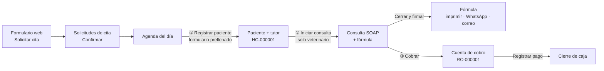

# 🩺 Módulo clínico de PataVida

Panel privado (`/panel`) para el equipo de la clínica. Todo vive en la app Django
`backend/clinica/` y en las páginas `frontend/app/panel/`.

## Roles

| Rol | Puede | No puede |
|---|---|---|
| **Veterinario** (`dra.laura`) | Todo: consultas SOAP, fórmulas, vacunas, historia clínica completa, envío de fórmulas, caja | — |
| **Recepción** (`recepcion`) | Citas, tutores, pacientes, vacunas por vencer, agenda, caja | Ver consultas, diagnósticos ni fórmulas (Ley 576 de 2000, art. 61) |

Los roles son Grupos de Django (`veterinario`, `recepcion`). Ver `clinica/permissions.py`.

## Flujo de atención



1. **Cita**: llega desde `/veterinaria` (formulario público, con consentimiento de datos y
   límite de 5 envíos por hora). Recepción la confirma en *Solicitudes de cita*.
2. **Agenda del día**: lista las citas confirmadas de una fecha y muestra en qué paso va cada una.
   - Si la mascota ya es paciente (mismo nombre y mismo celular del tutor), ofrece vincularla.
   - Si no, *Registrar paciente* abre el formulario con los datos de la cita. Solo falta
     la cédula del tutor y su autorización de datos (se piden en recepción).
3. **Consulta**: el veterinario la registra en formato SOAP (subjetivo, objetivo con signos
   vitales, análisis/diagnóstico, plan) con la fórmula médica. Al **cerrar y firmar** queda en
   solo lectura.
4. **Fórmula**: se imprime o guarda en PDF, se manda por **WhatsApp** (texto armado con `wa.me`)
   o por **correo** al email registrado del tutor. Nunca a un correo escrito a mano.
5. **Cobro**: cuenta con líneas del catálogo de servicios o líneas libres. El total lo calcula el
   servidor. Se paga con efectivo, tarjeta, transferencia o Nequi/Daviplata, o se anula con motivo.
6. **Caja**: cierre del día con el total cobrado por método de pago y lo pendiente por cobrar.

## Reglas de negocio (y por qué)

| Regla | Origen |
|---|---|
| Historia clínica reservada al veterinario | Ley 576 de 2000, art. 61 |
| Solo el veterinario formula | Ley 576 de 2000, art. 60 |
| Consulta firmada = solo lectura | Guía COMVEZCOL 2018 (registros electrónicos inmodificables) |
| Nada clínico se borra (`PROTECT`, sin `DELETE`) | Conservación mínima de 5 años |
| Autorización de datos obligatoria (con fecha) | Ley 1581 de 2012 |
| Número de historia (`HC-`) y de recibo (`RC-`) consecutivos | Trazabilidad |
| Cobro pagado o anulado no se modifica; anular exige motivo | Soporte contable |
| Total de cobros y pedidos calculado en el servidor | Seguridad |

> El recibo de caja **no reemplaza la factura electrónica de la DIAN**. Para facturar haría falta
> integrar un proveedor autorizado (Siigo, Alegra…).

## API (`/api/clinica/`)

| Ruta | Quién | Para qué |
|---|---|---|
| `GET veterinarios/` | Público | Perfil de los veterinarios en la web |
| `POST solicitudes-cita/` | Público | Formulario de cita |
| `GET/PATCH solicitudes-cita/?estado=&fecha=` | Personal | Gestión y agenda (vincula `paciente`) |
| `tutores/`, `pacientes/` | Personal | Registro (sin borrar) |
| `GET pacientes/{id}/historia/` | Veterinario | Historia clínica completa |
| `consultas/` · `POST consultas/{id}/cerrar/` | Veterinario | Consulta SOAP + fórmula, firma |
| `POST consultas/{id}/enviar-formula/` | Veterinario | Correo al tutor (20 por día) |
| `preventivos/` · `GET preventivos/vencimientos/` | Lectura: personal · escritura: veterinario | Vacunas y desparasitaciones |
| `GET servicios/` | Personal | Catálogo de precios (se edita en `/admin`) |
| `cobros/` · `POST cobros/{id}/pagar/` · `POST cobros/{id}/anular/` | Personal | Cuentas de cobro |
| `GET cobros/caja/?fecha=` | Personal | Cierre de caja |
| `GET resumen/` | Personal | Números del tablero |

## Datos demo

`python manage.py seed_clinica` (idempotente, corre en cada despliegue) crea:

- Usuarios `dra.laura` y `recepcion` con la clave de `CLINICA_DEMO_PASSWORD`.
- 3 tutores y 4 pacientes ficticios (Max, Luna, Rocky, Nala) con consultas, vacunas y una cita.
- 10 servicios con precios de ejemplo y 2 cobros (uno pagado, uno pendiente).

Si alguien "ensucia" el demo, se puede volver a correr; no duplica datos.

## Pruebas

```bash
cd backend
./venv/bin/python manage.py test clinica   # 34 pruebas
```

Cubren permisos por rol, inmutabilidad de consultas y cobros, total calculado en el servidor,
cierre de caja, envío de fórmulas (con el servicio de correo simulado) y el flujo de la agenda.
